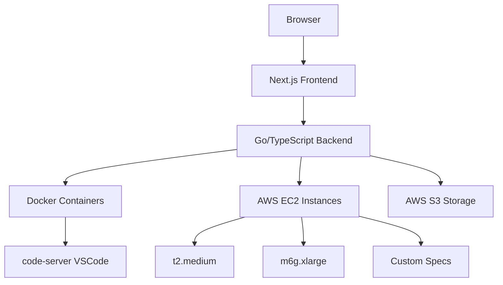

<div align="center">
  
  
  # Dev8.dev
  
  **🚀 The Future of Cloud Development Environments**
  
  *Launch customizable VS Code instances in the cloud with zero setup. Code anywhere, anytime.*
  
  [](https://discord.gg/xE2u4b8S8g)
  [](https://github.com/VAIBHAVSING/Dev8.dev/actions/workflows/ci.yml)
  [](https://github.com/VAIBHAVSING/Dev8.dev/actions/workflows/security.yml)
  [](https://opensource.org/licenses/MIT)
  [](LICENSE)
  [](https://github.com/VAIBHAVSING/Dev8.dev/stargazers)
  
  ---
  
  **[🌟 Try Demo](https://dev8.dev)** • **[📖 Documentation](https://docs.dev8.dev)** • **[💬 Discord](https://discord.gg/xE2u4b8S8g)** • **[🐛 Report Bug](https://github.com/VAIBHAVSING/Dev8.dev/issues)**
  
</div>

## ✨ What is Dev8.dev?

Dev8.dev is a **cloud-based IDE hosting platform** that revolutionizes how developers work. Think GitHub Codespaces, but with **unlimited flexibility** and **transparent pricing**.

Launch fully-configured VS Code environments in seconds, choose your perfect machine specs, and code from any device with just a browser. No more "it works on my machine" – your entire development environment lives in the cloud.

### 🎯 Perfect For

- **Remote Teams** - Standardized dev environments for everyone
- **Students** - Access powerful development tools from any device
- **Freelancers** - Switch between client projects instantly
- **Enterprises** - Secure, scalable development infrastructure

## 🚀 Key Features

<div align="center">
  <table>
    <tr>
      <td align="center" width="33%">
        <h3>⚡ Instant Launch</h3>
        <p>Go from zero to coding in <strong>30 seconds</strong>. Pre-configured environments with your favorite tools.</p>
      </td>
      <td align="center" width="33%">
        <h3>🎛️ Fully Customizable</h3>
        <p>Choose your <strong>machine specs</strong>, from lightweight t2.medium to powerful m6g.xlarge instances.</p>
      </td>
      <td align="center" width="33%">
        <h3>💾 Persistent Storage</h3>
        <p><strong>Never lose work</strong>. Your files, settings, and extensions persist across sessions.</p>
      </td>
    </tr>
    <tr>
      <td align="center" width="33%">
        <h3>🌐 Code Anywhere</h3>
        <p>Full <strong>VS Code experience</strong> in your browser. iPad, Chromebook, or desktop – it just works.</p>
      </td>
      <td align="center" width="33%">
        <h3>🔒 Enterprise Security</h3>
        <p><strong>SOC 2 compliant</strong> infrastructure with isolated containers and encrypted storage.</p>
      </td>
      <td align="center" width="33%">
        <h3>💰 Transparent Pricing</h3>
        <p><strong>Pay only for what you use</strong>. No hidden fees, no vendor lock-in.</p>
      </td>
    </tr>
  </table>
</div>

## 🏗️ Architecture



### Tech Stack

- **Frontend**: Next.js 15 + TypeScript + Tailwind CSS
- **Backend**: Go + TypeScript microservices
- **IDE**: code-server (VS Code in browser)
- **Containers**: Docker + Kubernetes (planned)
- **Cloud**: AWS (EC2, S3, VPC)
- **Auth**: NextAuth.js + OAuth providers

## 🚀 Quick Start

### For Users

1. **Sign up** at [dev8.dev](https://dev8.dev)
2. **Choose** your machine configuration
3. **Launch** your environment
4. **Start coding** immediately!

### For Developers

```bash
# Clone the repository
git clone https://github.com/VAIBHAVSING/Dev8.dev.git
cd Dev8.dev

# Install dependencies
pnpm install

# Set up environment variables
cp apps/web/.env.example apps/web/.env.local
# Edit .env.local with your configuration

# Start development
pnpm dev
```

## 🤖 CI/CD Pipeline

This project uses GitHub Actions for continuous integration and deployment:

### Automated Checks

Every pull request and push triggers:

- **🔍 Smart Change Detection**: Only runs relevant jobs based on changed files
- **🧹 Linting**: ESLint (TypeScript) + go vet + staticcheck (Go)
- **🎨 Code Formatting**: Prettier (TypeScript) + gofmt + goimports (Go)
- **🔒 Type Safety**: TypeScript strict compiler checks
- **🧪 Testing**: Unit tests for both Go and TypeScript applications
- **🏗️ Build Verification**: Next.js builds + Go binary compilation
- **🗄️ Database Testing**: PostgreSQL migration validation

### Security & Quality

- **🛡️ CodeQL Analysis**: Semantic security scanning
- **🔍 Vulnerability Scanning**: Trivy for dependencies
- **🔐 Go Security**: gosec static analysis
- **📦 Dependency Auditing**: npm audit for Node.js packages

### Local Development

Simulate the CI pipeline locally:

```bash
# Install the development tools
make install

# Run all CI checks locally
make ci

# Individual checks
make lint      # Lint all code
make format    # Format all code
make test      # Run all tests
make build     # Build all applications
```

### Performance Features

- **📦 Intelligent Caching**: Go modules, pnpm store, build artifacts
- **⚡ Parallel Execution**: Jobs run concurrently when possible
- **🎯 Conditional Execution**: Skip unchanged components

## 📁 Project Structure

```
Dev8.dev/
├── apps/
│   ├── web/          # Next.js frontend dashboard
│   ├── docs/         # Documentation site
│   └── agent/        # Go backend service
├── packages/
│   ├── ui/           # Shared React components
│   ├── eslint-config/
│   └── typescript-config/
└── infrastructure/   # Cloud infrastructure code
```

## 🌟 Roadmap

<details>
<summary><strong>🎯 Phase 1: MVP (Current)</strong></summary>

- [x] User authentication & dashboard
- [x] AWS EC2 integration
- [x] Basic code-server deployment
- [x] File persistence with S3
- [ ] Instance management (start/stop/delete)
- [ ] Basic monitoring & logs

</details>

<details>
<summary><strong>🚀 Phase 2: Scale</strong></summary>

- [ ] Kubernetes orchestration
- [ ] Auto-scaling instances
- [ ] Team collaboration features
- [ ] Custom Docker images
- [ ] SSH/terminal access
- [ ] Billing & usage tracking

</details>

<details>
<summary><strong>🌍 Phase 3: Expand</strong></summary>

- [ ] Multi-cloud support (GCP, Azure)
- [ ] Multiple IDE support (IntelliJ, Vim)
- [ ] Marketplace for extensions/templates
- [ ] API for third-party integrations
- [ ] Enterprise SSO & audit logs

</details>

## 💝 Support the Project

Love Dev8.dev? Here's how you can help us grow:

- ⭐ **Star this repo** to show your support
- 🐛 **Report bugs** and suggest features
- 💬 **Join our [Discord](https://discord.gg/xE2u4b8S8g)** community
- 🤝 **Contribute** code or documentation
- 💰 **Sponsor** our development efforts

<div align="center">
  <a href="https://github.com/sponsors/VAIBHAVSING">
    
  </a>
</div>

## 🤝 Contributing

We welcome contributions from developers of all skill levels! Check out our [Contributing Guide](CONTRIBUTING.md) to get started.

### Development Setup

```bash
# Fork and clone the repo
git clone https://github.com/YOUR_USERNAME/Dev8.dev.git

# Install dependencies
pnpm install

# Run the development servers
pnpm dev
```

## 👥 Community

<div align="center">
  
  **Join thousands of developers building the future of cloud development**
  
  [](https://discord.gg/xE2u4b8S8g)
  
  *Share your ideas, get help, and connect with other developers*
  
</div>

## 📄 License

This project is licensed under the MIT License - see the [LICENSE](LICENSE) file for details.

## 🙏 Acknowledgments

- The amazing [code-server](https://github.com/coder/code-server) team
- [Turborepo](https://turbo.build/) for the fantastic monorepo setup
- Our incredible [Discord community](https://discord.gg/xE2u4b8S8g)

---

<div align="center">
  <p><strong>Built with ❤️ by developers, for developers</strong></p>
  <p>
    <a href="https://dev8.dev">Website</a> •
    <a href="https://docs.dev8.dev">Docs</a> •
    <a href="https://discord.gg/xE2u4b8S8g">Discord</a> •
    <a href="https://twitter.com/dev8_dev">Twitter</a>
  </p>
</div>

You can build a specific package by using a [filter](https://turborepo.com/docs/crafting-your-repository/running-tasks#using-filters):

```
# With [global `turbo`](https://turborepo.com/docs/getting-started/installation#global-installation) installed (recommended)
turbo build --filter=docs

# Without [global `turbo`](https://turborepo.com/docs/getting-started/installation#global-installation), use your package manager
npx turbo build --filter=docs
yarn exec turbo build --filter=docs
pnpm exec turbo build --filter=docs
```

### Develop

To develop all apps and packages, run the following command:

```
cd my-turborepo

# With [global `turbo`](https://turborepo.com/docs/getting-started/installation#global-installation) installed (recommended)
turbo dev

# Without [global `turbo`](https://turborepo.com/docs/getting-started/installation#global-installation), use your package manager
npx turbo dev
yarn exec turbo dev
pnpm exec turbo dev
```

You can develop a specific package by using a [filter](https://turborepo.com/docs/crafting-your-repository/running-tasks#using-filters):

```
# With [global `turbo`](https://turborepo.com/docs/getting-started/installation#global-installation) installed (recommended)
turbo dev --filter=web

# Without [global `turbo`](https://turborepo.com/docs/getting-started/installation#global-installation), use your package manager
npx turbo dev --filter=web
yarn exec turbo dev --filter=web
pnpm exec turbo dev --filter=web
```

### Remote Caching

> [!TIP]
> Vercel Remote Cache is free for all plans. Get started today at [vercel.com](https://vercel.com/signup?/signup?utm_source=remote-cache-sdk&utm_campaign=free_remote_cache).

Turborepo can use a technique known as [Remote Caching](https://turborepo.com/docs/core-concepts/remote-caching) to share cache artifacts across machines, enabling you to share build caches with your team and CI/CD pipelines.

By default, Turborepo will cache locally. To enable Remote Caching you will need an account with Vercel. If you don't have an account you can [create one](https://vercel.com/signup?utm_source=turborepo-examples), then enter the following commands:

```
cd my-turborepo

# With [global `turbo`](https://turborepo.com/docs/getting-started/installation#global-installation) installed (recommended)
turbo login

# Without [global `turbo`](https://turborepo.com/docs/getting-started/installation#global-installation), use your package manager
npx turbo login
yarn exec turbo login
pnpm exec turbo login
```

This will authenticate the Turborepo CLI with your [Vercel account](https://vercel.com/docs/concepts/personal-accounts/overview).

Next, you can link your Turborepo to your Remote Cache by running the following command from the root of your Turborepo:

```
# With [global `turbo`](https://turborepo.com/docs/getting-started/installation#global-installation) installed (recommended)
turbo link

# Without [global `turbo`](https://turborepo.com/docs/getting-started/installation#global-installation), use your package manager
npx turbo link
yarn exec turbo link
pnpm exec turbo link
```

## Useful Links

Learn more about the power of Turborepo:

- [Tasks](https://turborepo.com/docs/crafting-your-repository/running-tasks)
- [Caching](https://turborepo.com/docs/crafting-your-repository/caching)
- [Remote Caching](https://turborepo.com/docs/core-concepts/remote-caching)
- [Filtering](https://turborepo.com/docs/crafting-your-repository/running-tasks#using-filters)
- [Configuration Options](https://turborepo.com/docs/reference/configuration)
- [CLI Usage](https://turborepo.com/docs/reference/command-line-reference)
